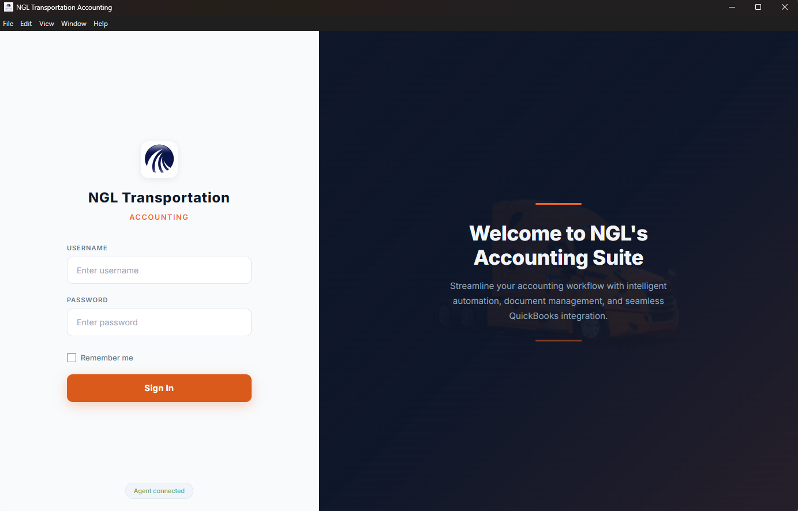
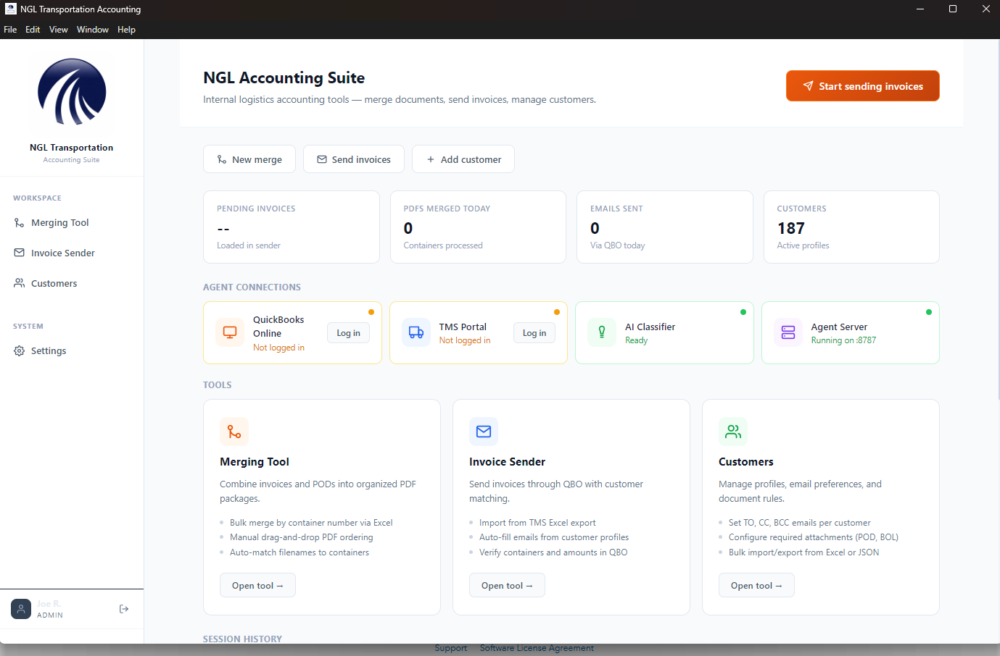
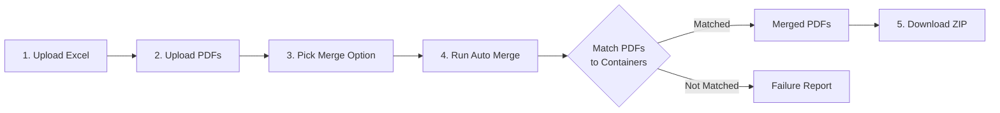
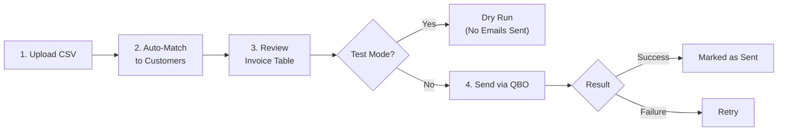
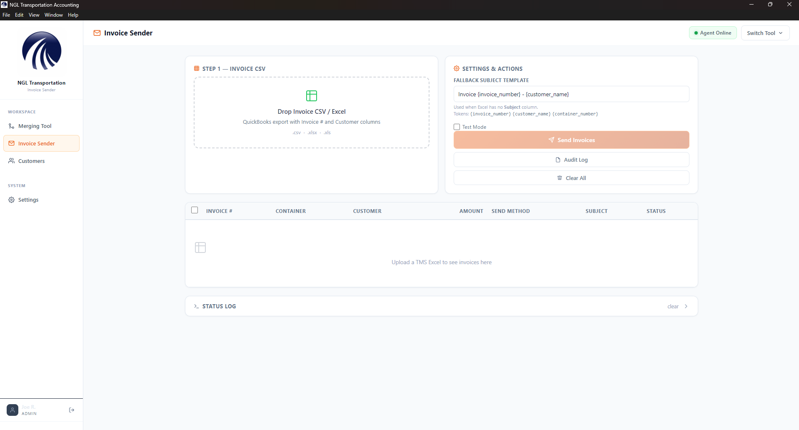
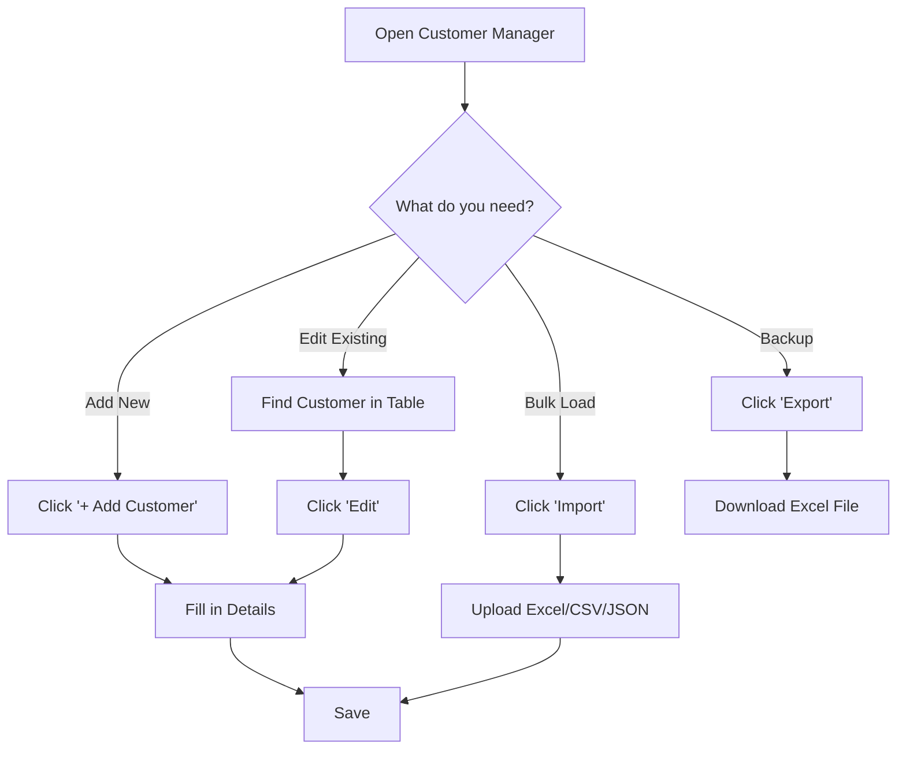
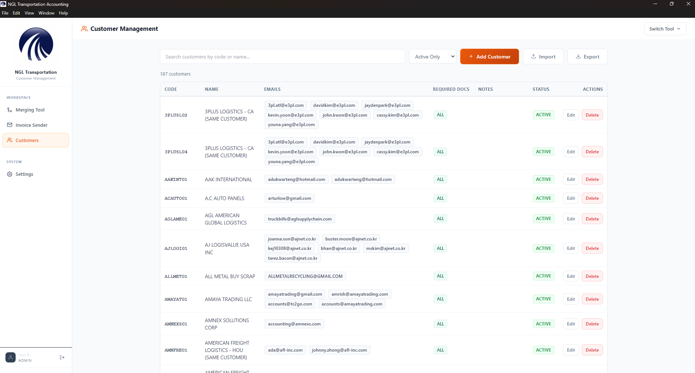
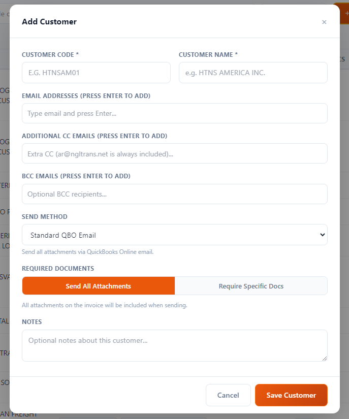
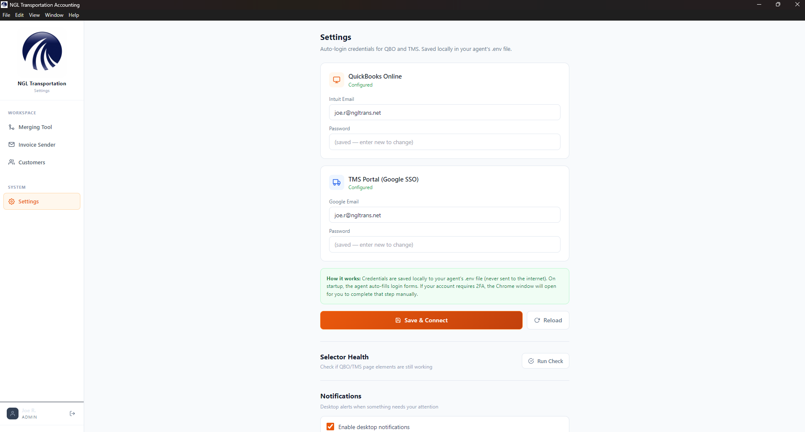

# NGL Accounting Suite — User Manual

**Version 1.0 | April 2026**

A plain-language guide to the Merge Tool, Invoice Sender, and Customer Manager.

> **Your files stay on your computer.** All PDF merging and Excel processing happens locally on your machine. Nothing is uploaded to the internet.

---

## Table of Contents

1. [What Is This App?](#1-what-is-this-app)
2. [Getting Started](#2-getting-started)
3. [Logging In](#3-logging-in)
4. [The Home Screen](#4-the-home-screen)
5. [Merge Tool — Combining Documents](#5-merge-tool--combining-documents)
   - [5.1 Auto Mode](#51-auto-mode-step-by-step)
   - [5.2 Manual Mode](#52-manual-mode-quick-merge)
   - [5.3 AI Agent Panel](#53-ai-agent-panel)
   - [5.4 Status Log & Failure Report](#54-status-log--failure-report)
6. [Invoice Sender — Emailing Invoices](#6-invoice-sender--emailing-invoices)
   - [6.1 Step by Step](#61-step-by-step)
   - [6.2 Send Methods](#62-send-methods-explained)
7. [Customer Manager](#7-customer-manager)
   - [7.1 Adding a Customer](#71-adding-a-customer)
   - [7.2 Editing and Deleting](#72-editing-and-deleting)
   - [7.3 Import and Export](#73-import-and-export)
8. [Settings & Connections](#8-settings--connections)
9. [Tips & Troubleshooting](#9-tips--troubleshooting)
10. [Glossary](#10-glossary)

---

## 1. What Is This App?

NGL Accounting Suite is a desktop tool built for the logistics accounting team. It has **three main tools**:

- **Merge Tool** — Combine invoices, PODs, and bills of lading into organized PDF packets — one per container.
- **Invoice Sender** — Upload a list of invoices, match them to PDF files, and send them through QuickBooks Online automatically.
- **Customer Manager** — Keep track of customer emails, document requirements, and send preferences.

---

## 2. Getting Started

### How to Open the App

- **Desktop app:** Double-click the **NGL Accounting** shortcut on your desktop.
- **Browser version:** Open the `app/index.html` file in Chrome or Edge.

### The Agent Server

The app uses a background service called the **Agent Server** to connect to QuickBooks Online (QBO) and TMS. Think of it as a helper that runs behind the scenes.

- **Desktop app:** The agent starts automatically — you don't need to do anything.
- **Browser version:** Run `Start Agent.bat` before using features that need QBO or TMS.

> **Note:** The Merge Tool and Customer Manager work without the agent. You only need the agent for sending invoices and fetching missing documents.

---

## 3. Logging In

When you open the app, you'll see the login screen.

1. **Type your username** in the first box.
2. **Type your password** in the second box.
3. **Click "Sign In"** to enter the app.

**"Remember me" checkbox:** Check this box and the app will save your login so you don't have to type it every time.

**Agent status badge:** Look at the bottom of the login screen:
- **Green — "Agent Online"** = Everything is working.
- **Red — "Agent Offline"** = The background service isn't running. See [Troubleshooting](#9-tips--troubleshooting).

---

## 4. The Home Screen

After logging in, you land on the **Home** screen. This is your dashboard.

### What You'll See

- **Metric cards** at the top showing quick numbers:
  - Pending Invoices
  - PDFs Merged Today
  - Emails Sent
  - Active Customers

- **Connection badges** showing what services are connected:

| Badge | Meaning |
|-------|---------|
| **Green — Connected** | Working normally |
| **Orange — Not Connected** | Not logged in yet (click to log in) |
| **Red — Offline** | Service is down — see [Troubleshooting](#9-tips--troubleshooting) |

- **Quick action buttons** — Click any card to jump straight to that tool:
  - "Merge Documents" → opens Merge Tool
  - "Send Invoices" → opens Invoice Sender
  - "Manage Customers" → opens Customer Manager

- **Sidebar** on the left — Click any tool name to switch pages.

---

## 5. Merge Tool — Combining Documents

The Merge Tool takes your PDFs (invoices, PODs, bills of lading) and combines them into neat packets. It has two modes:

| Mode | When to Use It |
|------|---------------|
| **Auto Mode** (most common) | You have an Excel spreadsheet listing containers and a folder of PDFs. The app figures out which PDFs go with which containers. |
| **Manual Mode** | You just want to combine 2 or more PDFs into one file. No Excel needed. |

### 5.1 Auto Mode — Step by Step

Here's the full workflow:

**Step-by-step instructions:**

1. **Click "Merge Tool"** in the sidebar.
2. **Drag your Excel file** (.xlsx) into the left drop zone, or click the zone to browse for it. The app reads the spreadsheet and finds columns like "Container Number" and "Invoice Number" automatically.
3. **Drag all your PDF files** into the right drop zone. You can drop them all at once — invoices, PODs, and bills of lading.
4. **Choose a merge option** (see table below). "Per Container" is the default and most common.
5. **Click "Run Auto Merge."** A progress bar shows the status as the app matches each PDF to its container and combines them.
6. **Download your results.** Click "Save to Folder" to get a ZIP file with everything organized, or download individual files.

### Merge Options

| Option | What It Does |
|--------|-------------|
| **Per Container** | Creates one PDF per container with all matching documents inside. *Most common choice.* |
| **All-in-One** | Merges everything into a single large PDF file. |
| **Invoices Only** | Only includes invoice PDFs (skips PODs and BLs). |
| **PODs Only** | Only includes Proof of Delivery documents. |
| **BLs Only** | Only includes Bills of Lading. |

### Sort Order

You can also choose how the output files are sorted:

| Sort | What It Does |
|------|-------------|
| **Excel Order** | Same order as your spreadsheet (default). |
| **Container #** | Alphabetical by container number. |
| **Invoice #** | Sorted by invoice number. |

> **Tip:** The app is smart about Excel column names. "Container #", "CNTR NO", "Container Number" — they all work. Same for invoice columns.

---

### 5.2 Manual Mode (Quick Merge)

For quick one-off merges when you don't have an Excel file:

1. **Switch to Manual Mode** using the toggle at the top of the page.
2. **Drag in 2 or more PDFs.**
3. **Reorder them** by dragging up or down — the order you set is the page order in the final PDF.
4. **Click "Merge"** to combine and download immediately.

---

### 5.3 AI Agent Panel

On the right side of the Merge Tool, you'll see the **AI Agent Panel**. This connects to QBO and TMS to automatically fetch documents you're missing.

**How to use it:**

1. Make sure the Agent Server is running (green badge on home screen).
2. Log into QBO and/or TMS using the buttons in the panel.
3. Upload your Excel file and PDFs as usual.
4. Click **"Auto-Fetch Missing"** — the app will search QBO and TMS for any PODs or invoices that aren't in your upload.
5. Fetched documents are automatically added to the merge.

> **Note:** You must be logged into QBO or TMS first. The panel shows login buttons if you're not connected yet.

---

### 5.4 Status Log & Failure Report

- **Status Log** (collapsible bar at the bottom): Shows real-time messages as the merge runs — which files are being processed, any warnings, and completion messages. Click the bar to expand or collapse it.
- **Failure Report**: After a merge finishes, this shows any containers where PDFs could not be matched. If a container appears here, check that your PDF file names contain the container number.

---

## 6. Invoice Sender — Emailing Invoices

The Invoice Sender lets you email invoices to customers through QuickBooks Online. Upload a list of invoices, the app matches them to your customers, and sends them automatically.

### 6.1 Step by Step

1. **Click "Invoice Sender"** in the sidebar.
2. **Drag your CSV or Excel file** into the drop zone. This file should have columns like Invoice Number, Customer Name, Amount, etc.
3. **The app auto-matches** each invoice to a customer in your database. Look at the table to see the results.
4. **Check the status column** for each row:

| Status | What It Means |
|--------|--------------|
| **Ready** (green) | Matched to a customer with an email — ready to send. |
| **No Email** (orange) | Customer found, but no email address on file. Go to Customer Manager and add one. |
| **No Match** (red) | Customer not in your database. Add them in Customer Manager first. |
| **Sent** (green) | Successfully sent. |
| **Error** (red) | Something went wrong — check the error message. |

5. **Click any invoice row** to open the **Review window** where you can edit the email address, subject line, or other details before sending.
6. **Set the Subject Template** (optional) — You can customize the email subject using tokens like `{invoice_number}` and `{customer_name}`. Example: `Invoice #{invoice_number} - {customer_name}`.
7. **Use Test Mode first** (recommended) — Check the "Test Mode" box to do a dry run. The agent fills in the QBO form but waits for your approval before actually sending.
8. **Click "Send Invoices"** to start. The app goes through each invoice, sends it via QBO, and updates the status in real time.

> **Tip:** Always do a test run first with "Test Mode" checked. This lets you verify everything looks right before sending for real.

---

### 6.2 Send Methods Explained

Each customer has a **send method** set in the Customer Manager. This controls how their invoices are delivered:

| Send Method | How It Works |
|-------------|-------------|
| **Standard QBO Email** | Sends all attachments (invoice, POD, BL) together in one email through QuickBooks Online. *Most common.* |
| **QBO Invoice Only + POD Email (OEC)** | Sends the invoice through QBO, then sends the POD in a separate email. Used for certain carriers that need the POD delivered separately. |
| **Portal Upload** | Merges the invoice and POD into one file and uploads it to the carrier's web portal. No email is sent through QBO. |

---

## 7. Customer Manager

The Customer Manager is where you store your customer profiles — their names, emails, document requirements, and send preferences. The Invoice Sender uses this information to know where and how to send each invoice.

### Finding a Customer

- **Search bar** at the top — Type a name or code to filter the table.
- **Active filter** — Switch between "Active Only" (default) and "All Customers" to include inactive ones.

### 7.1 Adding a Customer

1. **Click "+ Add Customer"** to open the form.
2. **Fill in the required fields:**
   - **Customer Code** — A short unique ID (like "ABC" or "FAST01"). This is how the system identifies the customer.
   - **Customer Name** — The customer's full name.
3. **Add email addresses:**
   - Type an email and press **Enter** to add it as a tag.
   - Click the **X** on any tag to remove it.
   - You can also add **CC** and **BCC** emails the same way.
4. **Choose a Send Method:**
   - Standard QBO Email (most common)
   - QBO Invoice Only + POD Email
   - Portal Upload
5. **Set Required Documents** (optional):
   - **"Send All Attachments"** — Sends everything (default).
   - **"Require Specific Docs"** — Check the boxes for which documents are required (Invoice, POD, BOL, etc.).
   - **Either/Or groups** — If a customer accepts POD *or* BOL (either one is fine), you can link them as a pair. The invoice will pass if at least one is attached.
6. **Add any notes** (optional).
7. **Click "Save Customer."**

---

### 7.2 Editing and Deleting

- **Edit:** Click the "Edit" button on any customer row. The same form opens with their existing information. Make changes and click "Update Customer."
- **Delete:** Click "Delete" on an active customer. This **deactivates** them (they become Inactive). They can be reactivated later by clicking "Activate."

> **Note:** Deleting a customer doesn't permanently remove them. It just hides them from the active list.

---

### 7.3 Import and Export

- **Import** — Click the "Import" button to load customers in bulk from an Excel, CSV, or JSON file.
  - Required columns: **Code** and **Name**.
  - Optional columns: Email, CC, BCC, Required Docs, Send Method, Notes.
  - The app matches column names automatically (flexible naming).

- **Export** — Click the "Export" button to download your entire customer list as an Excel file. Good for backups or sharing with coworkers.

---

## 8. Settings & Connections

Click **"Settings"** in the sidebar to manage your connections and preferences.

| Setting | What It Does |
|---------|-------------|
| **QuickBooks Online (QBO)** | Shows your QBO connection status. Click "Re-login" if your session expired. A browser window opens for you to sign in. |
| **TMS Connection** | Log in here to enable auto-fetching PODs from TMS. |
| **Notifications** | Toggle desktop notifications on or off. When enabled, you'll get a pop-up when a job finishes (useful if you're working in another window). |
| **Health Checks** | Shows whether the QBO and TMS connections are healthy. The app checks automatically every 15 seconds. |

---

## 9. Tips & Troubleshooting

### Best Practices

- **Always use Test Mode** in the Invoice Sender before doing a real send.
- **Keep customer emails up to date** — invoices can only be sent if the customer has an email on file.
- **Use "Per Container" merge** — it's the most organized format.
- **Check the Failure Report** after every merge to catch any unmatched PDFs.
- **Export your customer list regularly** as a backup.
- **Name your PDF files clearly** — include the container number or invoice number in the file name so the app can match them.

### Common Problems

| Problem | What to Do |
|---------|-----------|
| **"Agent Offline" badge** | The background service isn't running. Close and reopen the app, or run `Start Agent.bat`. |
| **QBO shows "Not Connected"** | Go to Settings and click "Re-login." A browser window will open for you to sign into QBO. |
| **Excel columns not recognized** | Make sure your spreadsheet has columns for Container Number and Invoice Number. The app accepts many name variations, but the column must exist. |
| **PDFs not matching to containers** | Check that your PDF file names contain the container number or invoice number somewhere in the name. |
| **Invoice shows "No Email"** | That customer doesn't have an email on file. Go to Customer Manager and add their email address. |
| **Invoice shows "No Match"** | The customer isn't in your database. Add them in Customer Manager first, then reload the CSV. |
| **Send failed for an invoice** | Usually means the QBO session timed out. Go to Settings, re-login to QBO, and retry. |
| **App is slow during merge** | This is normal for large batches (100+ containers). The app processes everything on your computer, so it depends on your machine's speed. Let it finish. |

---

## 10. Glossary

| Term | What It Means |
|------|--------------|
| **QBO** | QuickBooks Online — the accounting software used to send invoices. |
| **TMS** | Transportation Management System — used to track shipments and find POD documents. |
| **POD** | Proof of Delivery — a document confirming goods were delivered to the customer. |
| **BL / BOL** | Bill of Lading — the shipping contract document that travels with the cargo. |
| **Agent Server** | A background service on your computer that handles QBO and TMS connections. Think of it as a helper that runs behind the scenes. |
| **CSV** | Comma-Separated Values — a simple spreadsheet format. You can export CSVs from most accounting and spreadsheet programs. |
| **OEC** | A send method where the invoice goes through QBO and the POD is sent in a separate email. |
| **Container Number** | The unique ID stamped on a shipping container (e.g., MSCU1234567). Always 4 letters + 7 numbers. |
| **Drop Zone** | The dashed-border area in the app where you drag and drop files. You can also click it to browse. |

---

*NGL Accounting Suite — User Manual v1.0*
*Last updated: April 2026*
